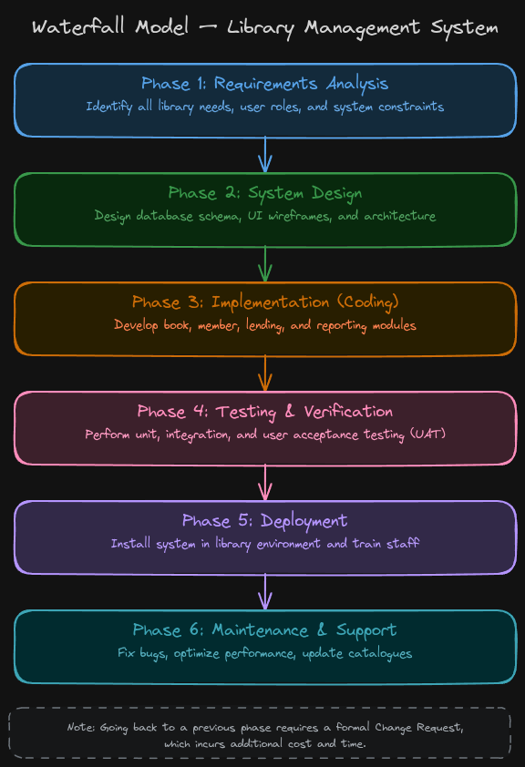

# Library Management System  
### SDLC Model: Waterfall Model  

---

## Project Details

| Field              | Information                               |
|--------------------|-------------------------------------------|
| Course             | Software Engineering                      |
| Assignment Type    | Individual Assignment                     |
| Time               | 48 Hours                                  |
| Topic              | SDLC Model Selection                      |

---

## 1. Introduction

A Library Management System (LMS) is a software application designed to manage and automate the day-to-day operations of a library. It serves as a centralized platform for librarians, students, and staff to efficiently handle book cataloguing, member registration, book borrowing and return, fine calculation, and report generation. :contentReference[oaicite:0]{index=0}  

### Key Functionalities

1. Book cataloguing and inventory management (ISBN, title, author, genre)  
2. Member registration and profile management  
3. Book issue and return processing with due date tracking  
4. Automated fine calculation for overdue books  
5. Search and filter capabilities for locating books  
6. Reports and statistics generation for administrators  

The system is intended for use in a college or public library environment. Since the requirements of a library are well-understood, stable, and unlikely to change drastically during development, the Waterfall model is the most appropriate SDLC approach for this project.

---

## 2. Selected SDLC Model

**Selected Model:** Waterfall Model  

The Waterfall Model is a linear, sequential software development approach where each phase must be completed fully before the next phase begins. It is one of the oldest and most straightforward SDLC methodologies.

### Phases

1. **Phase 1 — Requirements Analysis**  
   Gathering and documenting all functional and non-functional requirements from stakeholders.  

2. **Phase 2 — System Design**  
   Creating architectural design, database schema, UI mockups, and technology stack selection.  

3. **Phase 3 — Implementation (Coding)**  
   Actual development of modules based on the approved design documents.  

4. **Phase 4 — Testing and Verification**  
   Thorough unit testing, integration testing, and user acceptance testing (UAT).  

5. **Phase 5 — Deployment**  
   Installing and releasing the system in the live library environment.  

6. **Phase 6 — Maintenance and Support**  
   Bug fixes, performance optimization, and minor feature updates post-deployment.  

In the Waterfall model, documentation is produced at every phase, ensuring clarity, traceability, and ease of handover. Each phase serves as a foundation for the next, making it predictable and easy to manage.

---

## 3. Justification for Selecting the Waterfall Model

### 3.1 Stable and Well-Defined Requirements

The Library Management System has clearly understood requirements that are unlikely to change during development. Library operations such as book issue, return, cataloguing, and fine calculation are standardized and do not evolve dynamically. The Waterfall model works best when requirements can be gathered completely upfront, making it a perfect fit here. Since all requirements can be frozen at the start, there is no need for iterative rework.

### 3.2 Low Risk and Predictable Outcome

Library management is a low-risk domain with no mission-critical implications such as financial transactions or medical safety. The system does not need to handle highly volatile business rules. The Waterfall model's structured approach minimizes surprises, allows accurate time and cost estimation from the start, and ensures the project proceeds in a predictable manner without sudden scope changes.

### 3.3 Simple and Moderate Complexity

An LMS is moderately complex — it has multiple modules (book management, member management, lending, fines, reports) but each module is well-understood and loosely coupled. The Waterfall model handles such moderate complexity well because its phase-gate approach ensures that design is complete before coding begins, reducing the risk of integration failures later in the project.

### 3.4 Limited User Involvement Required

Unlike agile or iterative approaches, the Waterfall model does not require continuous end-user involvement throughout development. For a Library Management System, requirements can be gathered once through stakeholder interviews (librarians and administrators), documented formally, and approved before development begins. Users are involved primarily at the requirements stage and during user acceptance testing — which suits the Waterfall lifecycle perfectly.

### 3.5 Strong Documentation and Compliance

Since the LMS may be deployed in academic or government institutions, proper documentation is essential for maintenance, auditing, and future upgrades. The Waterfall model mandates documentation at each phase — requirements specification, design documents, test plans, and deployment guides — making it easy for future developers to understand and maintain the system.

---

## 4. Comparison with Other SDLC Models

| Model            | Reason It Seems Applicable                                      | Why It Is Less Suitable for LMS |
|------------------|---------------------------------------------------------------|--------------------------------|
| Agile Model      | Supports iterative delivery and continuous feedback loops     | LMS has stable, fixed requirements — Agile's iterative sprints add unnecessary overhead. Agile is better for projects where requirements evolve over time (e.g., social media apps, startup products). |
| Spiral Model     | Excellent for high-risk, large-scale projects requiring risk analysis | LMS is low-risk and moderately complex. The repeated risk analysis cycles of the Spiral model introduce unnecessary time and cost. Spiral is better suited for safety-critical systems like banking or aerospace software. |
| Incremental Model| Allows delivering working parts of the system in stages       | Since LMS modules are interdependent (lending requires book and member modules), delivering increments in isolation is difficult. Waterfall’s complete-design-before-coding approach is more practical. |

---

## 5. Waterfall Model Diagram

The diagram below represents the Waterfall Model as applied to the Library Management System. Each phase flows sequentially into the next, with the output of one phase serving as input to the next.

### Diagram References

For reference and editing, the original diagram is available below:

- **Excalidraw File:** `library-management-system.excalidraw`
- **Excalidraw Link:** [Open Diagram](https://excalidraw.com/#json=iT4_uFgwGGqOfH0EyTi5k,wkzpiKAI1DZn2Pc7k4FDHg)

> The Excalidraw file can be opened and edited using https://excalidraw.com
### Phase Breakdown

- **Phase 1: Requirements Analysis**  
  Identify all library needs, user roles, and system constraints  

- **Phase 2: System Design**  
  Design database schema, UI wireframes, and architecture  

- **Phase 3: Implementation**  
  Develop book, member, lending, and reporting modules  

- **Phase 4: Testing & Verification**  
  Perform unit, integration, and user acceptance testing  

- **Phase 5: Deployment**  
  Install system in the library and train staff  

- **Phase 6: Maintenance & Support**  
  Fix bugs, optimize performance, update catalogues  

---

### Important Note

In the Waterfall model, going back to a previous phase is possible only through a formal Change Request process, which incurs additional cost and time. This is why stable requirements are critical before beginning development.

---

## 6. Conclusion

The Library Management System is a well-understood, moderately complex project with stable and clearly defined requirements. After evaluating multiple SDLC models including Agile, Spiral, and Incremental, the Waterfall Model emerges as the most appropriate choice for this project.

The Waterfall model's linear, phase-by-phase approach ensures that the system is fully designed before coding begins, all requirements are documented formally, testing is thorough and systematic, and deployment is smooth and well-planned. Its emphasis on documentation also ensures long-term maintainability, which is vital for a system that may be used by institutions for many years.

Therefore, the Waterfall Model is the ideal SDLC for developing a Library Management System — delivering a complete, reliable, and well-documented software product within a predictable timeline and budget.

